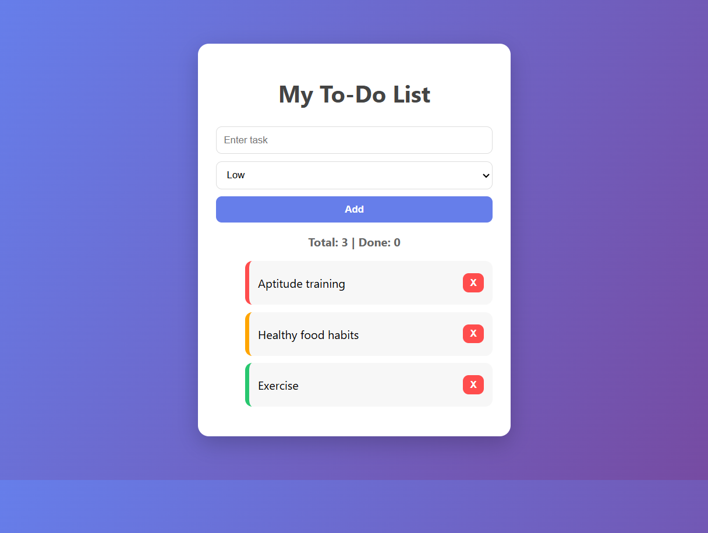

# 📝 Smart To-Do List Web App

## 📌 Project Overview
This project is a dynamic To-Do List web application built using HTML, CSS and Vanilla JavaScript as part of my web development internship task.

The goal of this project is to understand how interactive web applications work by manipulating the DOM and updating the UI in real time without page reload.

This project represents my first step into building interactive front-end applications.

---

## 🎯 Objective
The main goal of this task was to create a functional task manager that allows users to:

- Add new tasks  
- Mark tasks as completed  
- Delete tasks  
- View total and completed task count  
- Experience real-time UI updates  

---

## 🧩 Development Process

### 🏗️ App Structure
The application was structured using HTML to create input fields, buttons and a dynamic task list container.

### 🎨 Styling & Layout
CSS was used to create a clean and modern interface:

- Card-based centered layout  
- Color-coded task priorities  
- Hover effects for better user interaction  
- Responsive and minimal UI design  

### ⚙️ Functionality with JavaScript
Vanilla JavaScript was used to make the app interactive:

- DOM manipulation for dynamic task creation  
- Event listeners for user actions  
- Toggle functionality to mark tasks complete  
- Delete functionality for task removal  
- Live task counter updates  

---

## 💻 Technologies Used
- HTML5  
- CSS3  
- JavaScript (Vanilla JS)  
- DOM Manipulation  

---

## 📈 Key Learnings
Through this project, I learned how to:

- Work with DOM elements dynamically  
- Handle user events in JavaScript  
- Build interactive UI without frameworks  
- Manage application state using arrays  

---

## 📷 Preview

---

## 👩‍💻 Author
**Pradakshina S**  
Web Development Intern
